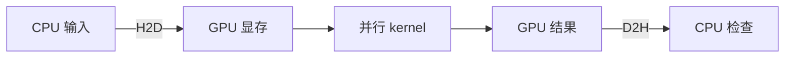

# GPU 编程：从一个数组开始

GPU 擅长让大量相似工作同时推进。本章目标是写出正确程序，再理解性能。需要会使用数组和函数；没有 GPU 也可以先完成 CPU 对照与纸面练习。

## 主机与设备

教程把运行普通 C++ 程序的 CPU 一侧称为主机，把 CUDA GPU 称为设备。典型流程是：准备数据、分配显存、复制输入、启动 kernel、复制结果、检查答案。kernel 是由许多 GPU 线程执行的函数。



传输和启动都有开销。小数组即使在 GPU 上计算很快，整体时间也可能比 CPU 长。先学习完整路径，不能只挑最快的 kernel 时间比较。

## 学习顺序

1. 阅读[GPU 架构](arch.md)，认识线程、block 和 warp。
2. 从 [CUDA 入门](cuda.md)的向量加法开始，跟踪每个线程负责的下标。
3. 运行仓库的完整实验，再看归约和矩阵乘法。
4. 阅读[优化](cuda-advanced.md)，用 [Nsight Systems](nsys.md)观察数据搬运与等待。
5. 按设备需要选读 NCCL、HIP、OpenCL、OpenACC。

## 检查环境

```bash
nvidia-smi
nvcc --version
```

前者检查驱动和设备，后者检查编译器。`nvidia-smi` 上的 CUDA 版本是驱动支持信息，不证明已安装 Toolkit。具体安装见[环境准备](../learning/setup.md)。

练习：能运行 PyTorch CUDA，是否必然能编译 `.cu` 文件？

??? success "参考答案"
    不一定。PyTorch 软件包可以带运行时库，但编译自定义 CUDA 程序还需要 nvcc、头文件和兼容的主机编译器。

参考：[CUDA 12.4 编程指南](https://docs.nvidia.com/cuda/archive/12.4.1/cuda-c-programming-guide/index.html)。
