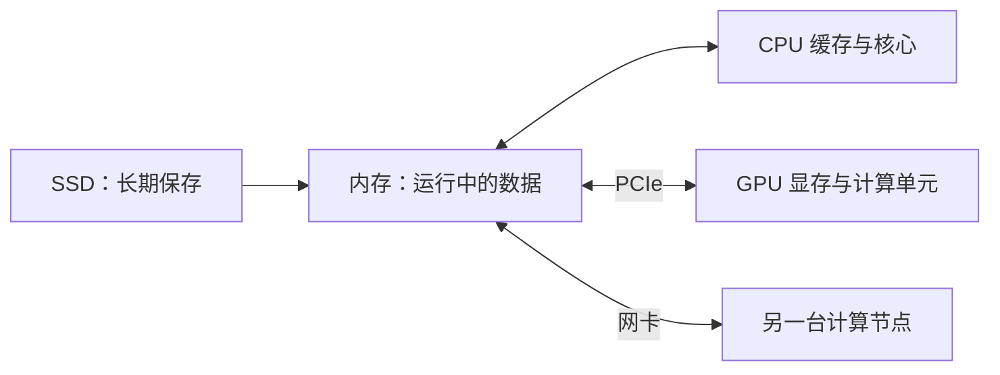

# 硬件：先认识一台计算机

程序慢，不一定是 CPU 算得慢。它也可能在等内存、磁盘，或者另一台机器发来的数据。本章的目标是学会提出一个问题：**现在是谁在等待谁？** 前置知识只需要变量、数组和循环。

## 数据经过哪里



CPU 执行指令，内存保存当前任务的数据。缓存是靠近核心的小容量存储。GPU 有自己的执行单元，独立显卡通常还有自己的显存。网络把多台机器连接起来。实际机器可能有更复杂的连接方式，这张图只表示常见的数据路径。

## 三个不同的问题

容量回答“装不装得下”。带宽回答“每秒能搬多少”。延迟回答“一次请求多久得到响应”。一个容量很大的硬盘，并不一定能及时给 GPU 送数据。

假设程序读取 8 GB 数据，实际内存带宽为 40 GB/s。只考虑传输，至少需要约 0.2 秒。这只是理想估算，还没有计入计算、同步和额外读写。GB 是十进制，GiB 是二进制，比较数字时先统一单位。

## 第一次观察

在 Linux 终端运行：

```bash
lscpu
free -h
lsblk -o NAME,TYPE,SIZE,MOUNTPOINTS
```

记录处理器型号、物理核心与逻辑 CPU 数、内存容量、磁盘类型。在容器中，还要查看 `cpu.max` 和 `memory.max`；宿主机总资源不等于你的配额。缺少某个命令时可先阅读其手册，不需要管理员权限才能理解本章。

## 本章实验：画出自己的机器（约 2 小时）

完成上面的资源表，再运行[内存访问实验](memory.md)。写出一个猜想，例如“跨步访问的每元素开销更高”，然后用记录验证。报告中列出输入规模、编译器、命令和至少五次测量。

练习：有 64 GB 内存、8 GB 显存的机器，能否直接把 20 GB 数组放入显存？

??? success "参考答案"
    通常不能。可分块处理、压缩表示或使用更大显存的设备。统一内存可能通过迁移支持更大的地址范围，但不等于显存变大，也不保证性能。

继续阅读：[处理器](processor.md)、[内存](memory.md)、[GPU 架构](../gpu/arch.md)。参考：[Linux 内核 cgroup v2 文档](https://docs.kernel.org/admin-guide/cgroup-v2.html)。
