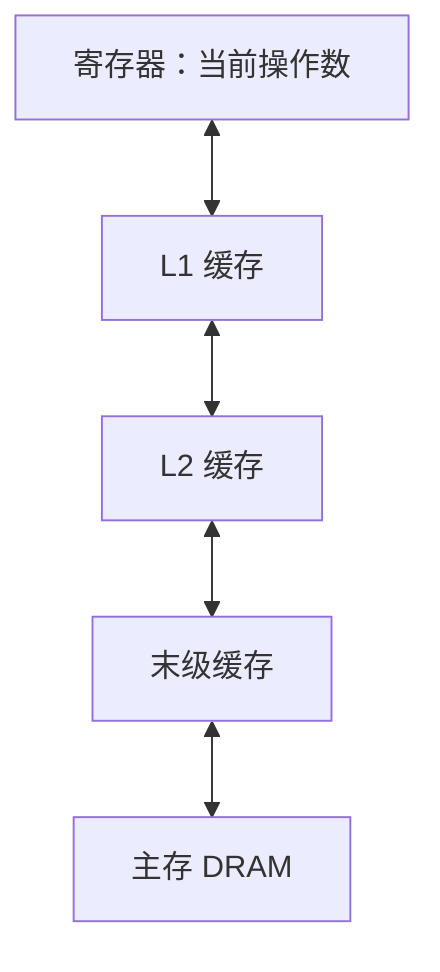

# 内存：容量够了，为什么还慢

本节解释缓存、内存带宽和访问局部性。你需要知道数组下标的含义。

## 越近通常越快，也越小

寄存器保存当前计算直接使用的值。缓存保存最近可能再次使用的数据。主存容量较大，但访问通常更慢。CPU 常按缓存行搬运数据，而不是只搬一个变量。常见缓存行大小为 64 字节，具体以机器为准。



时间局部性是“刚用过，马上又用”。空间局部性是“用了这个位置，接着用旁边的位置”。连续遍历数组常能利用空间局部性。链表随机跳转则可能不断等待新数据。

## 动手：改变步长

仓库中的 `examples/cpu/memory.c` 分配约 128 MiB 数组，用步长 1、8、64 读取。它输出每次有效访问的耗时和有效字节带宽。

```bash
make -C examples cpu
./build/memory
```

每种步长都检查结果。比较 `ns_per_element`，不要直接比较总时间：步长越大，访问的元素越少。`useful_GBps` 只统计程序使用的字节，不是内存控制器的实际流量。读取一个 double 可能触发一整条缓存行的传输。

## 用简单模型判断瓶颈

向量加法对每个元素做一次加法，却至少要读两个数、写一个数。单精度情况下，理想有效流量是 12 字节。若没有复用，这种计算通常需要关注带宽。

矩阵乘法可以重复使用已载入的小块数据。分块的目的就是减少重复搬运。后面会在 [CUDA 优化](../gpu/cuda-advanced.md)中实现它。

练习：把数组缩到完全能放入缓存，再运行，会怎样？

??? success "参考答案"
    数据可能更多地由缓存提供，每次访问更快。此时测到的不能称为 DRAM 带宽。实验应记录工作集大小，并说明是否超过缓存容量。

参考：[STREAM 基准及说明](https://www.cs.virginia.edu/stream/)、[Linux 内核缓存相关文档](https://docs.kernel.org/core-api/cachetlb.html)。
