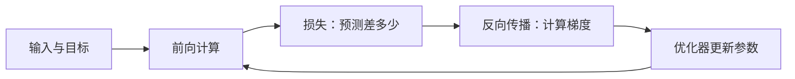

# 科学计算与机器学习系统：从方程到训练

本章连接前面的硬件与并行知识。科学计算把数学模型转为可计算的问题；机器学习训练通过数据调整模型参数。二者都依赖数值表示、算子和高效的数据流。

## 从一个线性方程开始

`Ax=b` 中，A 是矩阵，b 是已知向量，x 是待求结果。矩阵乘法、向量运算和方程求解有成熟数值库。实际应用通常先使用 BLAS、LAPACK、SciPy 或 GPU 库，再优化测出的瓶颈。

浮点数只能表示有限精度。`0.1+0.2` 不一定和十进制直觉完全一致。检查数值程序时，通常需要绝对误差和相对误差，而不是所有元素逐位相等。

残差 `r=Ax-b` 检查结果是否满足方程。小残差与小解误差不是同一个概念；病态问题会放大数据或舍入扰动。本课程先用性质良好的小问题练习。

## 第一个数值实验

```bash
python examples/science/solve.py
```

程序构造三对角正定矩阵，用已知解产生右端项，再分别用稠密求解和稀疏共轭梯度求解。它检查收敛状态、相对残差与两种结果的一致性。

## 再看训练循环



推理主要执行前向计算。训练还需要梯度和优化器状态，所以显存需求往往更高。

```bash
python examples/ml/train.py --device cpu
python examples/ml/train.py --device cuda
```

实验使用合成线性回归，检查训练流程和损失下降，不代表真实任务上的模型质量。

## 综合实验（约 3 小时）

运行求解、训练、[精度](quantization.md)和[稀疏](sparsity.md)示例。记录结果误差与耗时范围，说明哪些工作由库完成。保持同一输入，再改变一个参数，解释结果。

练习：损失下降是否证明模型会处理未见过的数据？

??? success "参考答案"
    不能。训练损失只说明对当前训练数据的拟合。真实任务还需要独立验证或测试数据，避免数据泄漏。本例只验证训练程序流程。

参考：[SciPy 线性代数](https://docs.scipy.org/doc/scipy/tutorial/linalg.html)、[PyTorch 入门](https://pytorch.org/tutorials/beginner/basics/intro.html)。
