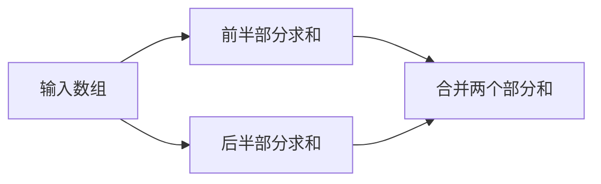

# 从顺序执行到并行执行

一个循环通常按顺序处理数据。并行程序尝试让多个执行单元同时工作。本节先回答“哪些工作可以拆开”，再介绍进程与线程。你需要会阅读简单循环。

## 并发与并行

并发是多个任务在一段时间内交替推进。并行强调同一时刻有多个任务执行。单核也能通过时间片实现并发，但不能因此得到多个物理核心的计算能力。

考虑计算数组平方：`b[i] = a[i] * a[i]`。每个输出只依赖对应的输入，各项可以独立处理。再考虑 `a[i] = a[i-1] + 1`：第 i 项依赖前一项，直接把循环分给多个线程会破坏顺序。

## 用什么承载任务

| 方式 | 默认地址空间 | 常见工具 | 适合起步的任务 |
| --- | --- | --- | --- |
| 多进程 | 分开 | MPI、Python multiprocessing | 分块后交换结果 |
| 多线程 | 共享进程地址空间 | OpenMP、Pthreads | 一台机器内的数组循环 |

进程也能显式共享内存。线程也需要处理通信与同步。“共享”只表示可以访问同一份数据，不表示访问自然正确。

## 先画任务图

运行[OpenMP 求和](../parallel-programming/openmp.md)，先预测 1 与 4 个线程的输出，再比较结果。合并阶段叫归约，它会在后面反复出现。

练习：把 10 个元素交给 3 个工作者，怎样避免漏掉最后一个元素？

??? success "参考答案"
    第 r 个工作者处理 `[10*r/3, 10*(r+1)/3)`，整数除法向下取整。区间是 `[0,3)`、`[3,6)`、`[6,10)`，正好覆盖全部元素。

参考：[OpenMP 官方示例](https://www.openmp.org/resources/tutorials-articles/)。接着读[进程](process.md)和[线程](thread.md)。
